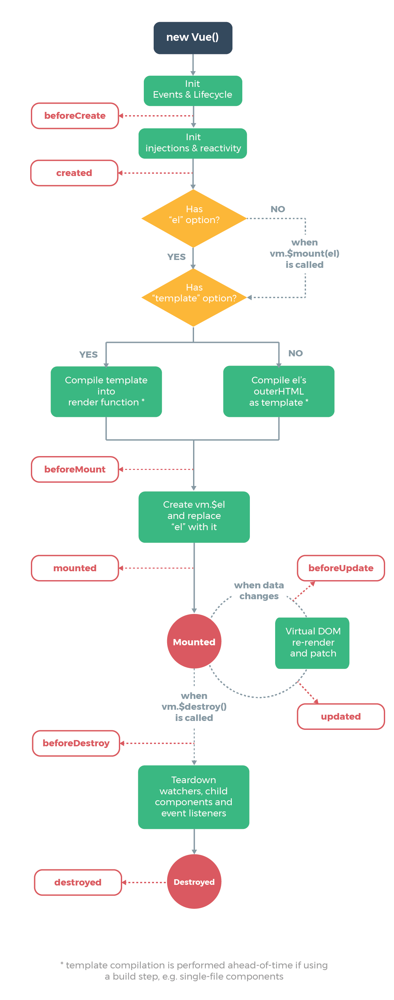
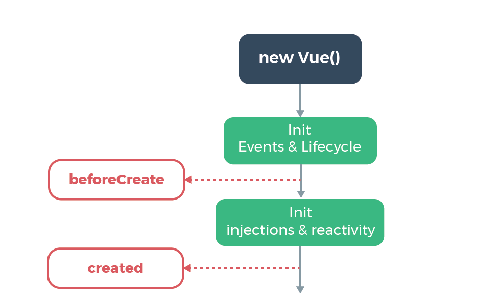
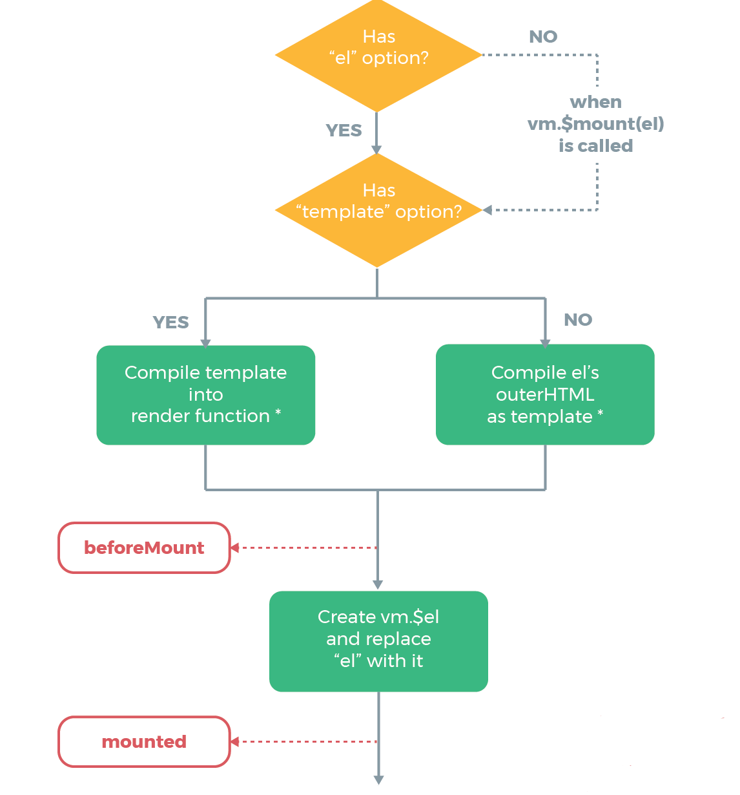
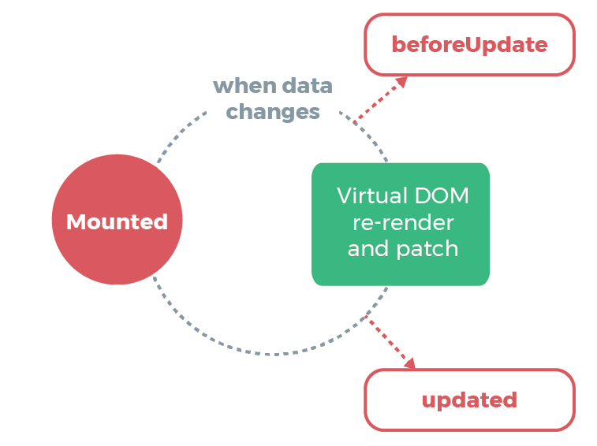
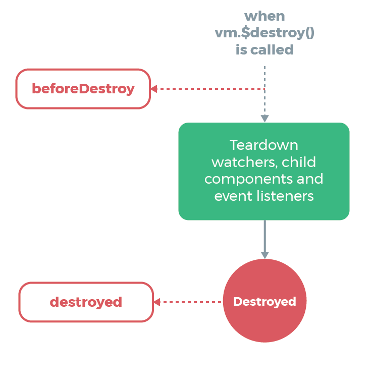

### Demystifying the Vue Lifecycle
@snap[text-07]
Jaime Jones
@snapend

Note:

An overview of the Vue lifecycle with examples of when to use each lifecycle method. Also examines various pieces of the Vue instance and how to use them effectively and the pitfalls associated. Examples would be things like v-for key and the pitfalls of just using index, $refs and when to use them, and $nextTick and the problems it can help solve.

---

@snap[north span-100]
### What is the Vue Lifecycle?
@snapend

- Begins when the Vue instance (your component) initializes
- Has a cycle it goes through as observable data changes
- Has an end when a component is destroyed

---

@snap[midpoint span-29]

@snapend

---

@snap[north span-100]
### Lifecycle Hooks
@snapend

- Let us run code at various points in the instance lifecycle
- A lot of hooks: beforeCreate, created, beforeMount, mounted, beforeUpdate, updated, activated, deactivated, beforeDestroy, destroyed, errorCaptured

Note:

Example usage - note that you cannot use arrow functions as they break the binding of `this`

---

@snap[west span-60]

@snapend

@snap[east span-40 text-07]
Note that if you are using the Composition API, `setup` is called after `beforeCreate` and right before `created`
@snapend

---

@snap[north span-100]
### beforeCreate
@snapend


@snap[midpoint span-100]
@snap[text-07]
You will have access to the instance itself! But you will _not_ have access to any of the data or events on the instance.
@snapend
```javascript
export default {
  data() {
    return {
      foo: 'bar'
    }
  },
  beforeCreate() {
    console.log(this);
    // This will work and will return the component instance
    console.log(this.foo);
    // This will return undefined as data has not yet been initialized 
  }
}
```
@snapend

Note:

Called synchronously immediately after the instance has been initialized, before data observation and event/watcher setup.

---

@snap[north span-100]
### created
@snapend

@snap[midpoint span-100]
@snap[text-07]
You now have access to data, so this is the ideal time to populate any initial data your component needs!
@snapend
```javascript
export default {
  data() {
    return {
      cupcakes: []
    }
  },
  created() {
    axios({ /* Call and get the cupcakes! */ })
      .then(res => {
        this.cupcakes = res.data;
      })
  }
}
```
@snapend

Note:

Called synchronously after the instance is created. At this stage, the instance has finished processing the options which means the following has been set up: data observation, computed properties, methods, watch/event callbacks. However, the mounting phase has not been started, and the `$el` property will not be available yet.

---

@snap[midpoint]

@snapend

---

@snap[north span-100]
### beforeMount
@snapend

@snap[south span-100]
```html
<div id="app" data-dessert="cake"></div>
```

```javascript
new Vue({
  el: '#app',
  data() {
    return {
      entree: 'spaghetti'
    }
  },
  template: '<div>{{ entree }}</div>',
  beforeMount() {
    console.log(this.$el); // <div id="app" data-dessert="cake"></div>
    console.log(this.$el.dataset.dessert); // cake
  },
  mounted() {
    console.log(this.$el); // <div>spaghetti</div>
    console.log(this.$el.dataset.dessert); // undefined
  }
});
```
@snapend

Note:

Called right before the mounting begins: the `render` function is about to be called for the first time. **This hook is not called during server-side rendering.**

---

@snap[north span-100]
### mounted
@snapend

@snap[midpoint span-100]
@snap[text-07]
An ideal time for integrating outside libraries or accessing the DOM itself.
@snapend
```html
<div class="my-chart"></div>
```

```javascript
export default {
  data() {
    return {
      chartData: { ... },
      chartOptions: { ... }
    }
  },
  mounted() {
    new Chartist.Bar(`.my-chart`, chartData, chartOptions);
  }
}
```
@snapend

Note: 

Called after the instance has been mounted, where `el` is replaced by the newly created `vm.$el`. If the root instance is mounted to an in-document element, `vm.$el` will also be in-document when `mounted` is called.
**This hook is not called during server-side rendering.**

---

@snap[midpoint]

@snapend

---

@snap[north span-100 text-08]
### beforeUpdate
@snapend

@snap[south span-100]
```html
<div ref="counter">{{ count }}</div>
<button @click="increaseCount">Click me!</button>
```

```javascript
export default {
  data() {
    return {
      count: 0
    }
  },
  beforeUpdate() {
    console.log(this.count); // 1
    console.log(this.$refs.counter.textContent) // 0
  },
  methods: {
    increaseCount() {
      this.count++;
    }
  }
}
```
@snapend

Note:

Called when data changes, before the DOM is patched. This is a good place to access the existing DOM before an update, e.g. to remove manually added event listeners.
**This hook is not called during server-side rendering, because only the initial render is performed server-side.**

---

@snap[north span-100 text-08]
### updated
@snapend

@snap[south span-100]
```html
<div ref="counter">{{ count }}</div>
<button @click="increaseCount">Click me!</button>
```

```javascript
export default {
  data() {
    return {
      count: 0
    }
  },
  updated() {
    console.log(this.count); // 1
    console.log(this.$refs.counter.textContent) // 1
  },
  methods: {
    increaseCount() {
      this.count++;
    }
  }
}
```
@snapend

Note:

Called after a data change causes the virtual DOM to be re-rendered and patched.
The component's DOM will have been updated when this hook is called, so you can perform DOM-dependent operations here. However, in most cases you should avoid changing state inside the hook. To react to state changes, it's usually better to use a computed property or watcher instead.
Note that `updated` does **not** guarantee that all child components have also been re-rendered. If you want to wait until the entire view has been re-rendered, you can use `vm.$nextTick` inside of `updated`:
```javascript
updated() {
  this.$nextTick(function() {
    // Code that will run only after the
    // entire view has been re-rendered
  })
}
```
**This hook is not called during server-side rendering.**

---

@snap[midpoint]

@snapend

---

@snap[north span-100]
### beforeDestroy
@snapend

@snap[midpoint span-100]
@snap[text-07]
The instance itself is still available to you.
@snapend
```javascript
export default {
  beforeDestroy() {
    this.$emit('setParentMessage', 'The child has been destroyed');
    // must be set here when the instance is fully functional
  }
}
```
@snapend

Note:

Called right before a Vue instance is destroyed. At this stage the instance is still fully functional.
**This hook is not called during server side rendering.**

---

@snap[north span-100]
### destroyed
@snapend

@snap[midpoint span-100]
@snap[text-07]
Ideal place for any final clean up!
@snapend
```javascript
export default {
  mounted() {
    document.addEventListener('keydown', this.handleEscape);
  },
  destroyed() {
    document.removeEventListener('keydown', this.handleEscape);
  },
  methods: {
    handleEscape(e) {
      if (e.key === 'Escape') {
        this.$emit('closeModal');
      }
    }
  }
}
```
@snapend

Note:

Called after a Vue instance has been destroyed. When this hook is called, all directives of the Vue instance have been unbound, all event listeners have been removed, and all child Vue instances have also been destroyed.
**This hook is not called during server-side rendering.**

---

@snap[north span-100]
### errorCaptured
@snapend

@snap[midpoint span-100]
```html
<p v-if="error">{{ error }}</p>
<child-cmp></child-cmp>
```

```javascript
export default {
  data() {
    return {
      error: null
    }
  },
  errorCaptured(err, vm, info) {
    console.warn(err, vm, info);
    this.error = 'Oops, something went wrong!';
    return false;
  }
}
```
@snapend

Note:

Called when an error from any descendent component is captured. The hook receives three arguments: the error, the component instance that triggered the error, and a string containing information on where the error was captured. The hook can return false to stop the error from propagating further.

You can modify component state in this hook. Be careful to avoid infinite renders.

- By default, all errors are still sent to the global `config.errorHandler` if it is defined, so that these errors can still be reported to an analytics service in a single place.
- If multiple `errorCaptured` hooks exist on a component’s inheritance chain or parent chain, all of them will be invoked on the same error.
- If the `errorCaptured` hook itself throws an error, both this error and the original captured error are sent to the global `config.errorHandler`.
- An `errorCaptured` hook can return `false` to prevent the error from propagating further. This is essentially saying “this error has been handled and should be ignored.” It will prevent any additional `errorCaptured` hooks or the global `config.errorHandler` from being invoked for this error.

---

@snap[north span-100 text-08]
### Keep Alive Components
@snapend

@snap[south span-100]
```html
<button @click="setView('PuppyCmp')">See puppies!</button>
<button @click="setView('KittenCmp')">See kittens!</button>

<keep-alive>
  <component :is="activeView"></component>
</keep-alive>
```

```javascript
export default {
  components: { PuppyCmp, KittenCmp },
  data() {
    return {
      activeView: 'PuppyCmp'
    }
  },
  methods: {
    setView(view) {
      this.activeView = view;
    }
  }
}
```
@snapend

Note:

`<keep-alive>` is meant to be used with one direct child component and does not work with `v-for`. If you are using conditionals, there must be only one child rendered at a time.

---
@snap[north span-100]
### activated
@snap[text-05]
Used with `<keep-alive>`
@snapend
@snapend

@snap[midpoint span-100]
```html
<p v-if="showWelcomeBack">Welcome back! The puppies missed you!</p>
```

```javascript
export default {
  data() {
    return {
      showWelcomeBack: false
    }
  },
  activated() {
    this.showWelcomeBack = true;
  }
}
```
@snapend

Note:

Called when a kept-alive component is activated.
**This hook is not called during server-side rendering.**

---
@snap[north span-100]
### deactivated
@snap[text-05]
Used with `<keep-alive>`
@snapend
@snapend

@snap[midpoint span-100]
```javascript
export default {
  data() {
    return {
      previousScroll: {
        x: null,
        y: null
      }
    }
  }
  deactivated() {
    this.previousScroll.x = window.scrollX;
    this.previousScroll.y = window.scrollY;
  }
}
```
@snapend

Note:

Called when a kept-alive component is deactivated.
**This hook is not called during server-side rendering.**

---

### ...and other pieces of the Vue instance

---

@snap[north span-100]
### nextTick
@snapend

@snap[south span-100]
```html
<div ref="errorContainer">
  <p v-if="error">{{ error }}</p>
</div>
```

```javascript
export default {
  data() {
    return {
      error: null
    }
  },
  methods: {
    setError(err) {
      this.error = err;
      this.$nextTick().then(() => {
        this.$refs.errorContainer.scrollIntoView();
      })
    }
  }
}
```
@snapend

Note:

Defer the callback to be executed after the next DOM update cycle. Use it immediately after you’ve changed some data to wait for the DOM update.

Mounted example
> Note that mounted does **not** guarantee that all child components have also been mounted. If you want to wait until the entire view has been rendered, you can use `vm.$nextTick` inside of `mounted`:
```javascript
mounted() {
  this.$nextTick(function() {
    // Code that will run after the
    // entire view has been rendered
  })
}
```

Updated example

---

@snap[north span-100 text-05]
### v-for and :key
@snapend

@snap[south span-100 code-05]
```html
<book-cmp v-for="(book, index) in books" :key="index" :book="book" />
OR
<book-cmp v-for="(book, index) in books" :key="book.id" :book="book" />
```
```html
<div class="book">
  <h1>{{ book.title }}</h1>
  <div v-if="isCheckedOut" class="label">Checked Out</div>
</div>
```

```javascript
export default {
  props: ['book'],
  data() {
    return {
      isCheckedOut: null
    }
  },
  mounted() {
    this.checkBookStatus(this.book.id);
  },
  methods: {
    checkBookStatus() {
      axios('/book-status/' + this.book.id)
        .then(res => { this.isCheckedOut = res.data.isCheckedOut; })
    }
  }
}
```
@snapend

---

@snap[north span-100 text-05]
### refs
@snapend

@snap[south span-100 code-05]
```html
<div ref="myDiv" class="text--navy">Hello!</div>

<puppy-cmp ref="myPuppy"></puppy-cmp>

<template v-for="kitten in kittens">
  <kitten-cmp
    ref="myKittens"
    :kitten="kitten"
    :key="kitten.id">
  </kitten-cmp>
</template>
```

```javascript
export default {
  data() {
    return {
      kittens: []
    }
  }
  mounted() {
    console.log(this.$refs.myDiv);
    // <div class="text--navy">Hello!</div>
    console.log(this.$refs.myCmp);
    // returns the instance of puppy-cmp
    console.log(this.$refs.myKittens);
    // returns an array of component instances of kitten-cmp
  }
}
```
@snapend

---

@snap[north]
### Thank you!
@snapend

@snap[midpoint span-100]
Twitter: `@gameof_freckles`

www: `jai.me`
@snapend